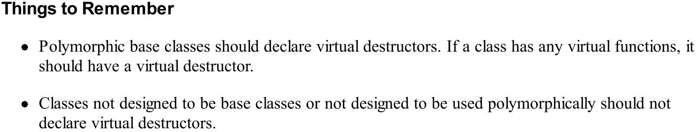

## Item 5

在没有显示申明ctor、dtor、copy ctor、copy assignment时，如果代码中用到了这些函数，编译器会自动帮我们生成这些函数的默认版本。

如果class中有引用成员变量，那么编译器不会为我们生成copy assignment，我们需要手动写赋值函数。

## Item 6

不允许复制class的操作被编译（copy construct 、assignment），将class的copy ctor、assginment申明为private，同时不实现这些函数。STL中的iostream相关类就是这么做的。


## Item 7

c++中删除父类指针指向的子类对象时，如果父类的析构函数不是虚函数（non-virtual），那么子类的析构函数就不会被调用，造成内存泄漏：

```c++
Base *pson = son; // class Base is father, class Son is derived class
delete pson;
```

将父类的析构函数标识为虚函数，可以避免这个问题。

如果class中不存在虚函数，一般而言不会将其析构函数申明为虚函数，也不会将这个class作为基类（base class）。因为如果class中存在虚函数，compiler会被这个class生成虚函数表（vtbl），以及指向虚函数表的虚指针（vptr），存储vtbl和vptr都需要占用额外的内存空间。所以当且仅当class中有虚函数时，才考虑是否将class的析构函数标识为virtual。

抽象类（abstract class）的析构函数如果是纯虚函数（`virtual ~dtor() = 0`），那么需要在类外定义（define）析构函数；不然继承类无法通过编译器的链接阶段。

当需要通过父类提供的接口来控制子类时（多态），需要将析构函数申明为虚函数，防止内存泄漏。



## Item 8

## Item 9

不要在ctor或dtor中调用纯虚函数（pure virtual function），考虑以下代码：

```c++
class Transaction {
 public:
  Transaction() {
    logTransaction(); // make type-dependent log entry
  }
  virtual void logTransaction() const = 0;
};

class BuyTransaction : public Transaction {
 public:
  virtual void logTransaction() const override; // how to log transactions of this type
};

BuyTransaction b;
```

当我们声明`BuyTransaction`时会发生什么？首先，`BuyTransaction`的ctor会被调用，因为`BuyTransaction`是子类，所以首先会调用父类`Transaction`的ctor，父类ctor中调用了纯虚函数`logTransaction()`；此时就会产生问题。

这里将调用纯虚函数而不是子类中实现的函数，尽管我们声明的变量的type是`BuyTransaction`，但是当父类ctor还未运行完成时，子类是不存在的，更不用说子类中实现的函数。所以编译器会报链接错误，因为找不到虚函数的实现。同理，在dtor中，销毁的顺序是先子类，后父类，如果在父类dtor中调用子类的函数，就会报错，因为此时子类已经被销毁了。

> During base class construction of a derived class object, the type of the object is that of the base class

## Item 10

class的赋值操作（operator=）返回类型应该是这个类的引用。

```c++
class Widget {
    Widget& operator=(const Widget &rhs) { // return type is a reference to the current class
        return *this; // return the left-hand object
    }
}
```

## Item 11

编写类赋值操作（operator=）时要考虑自我赋值的情况，防止一些隐式的自我赋值，比如指针赋值，但指向的是同一个对象。

最简单的做法是在操作前进行一次判断：

```c++
class Bitmap {};
class Widget {
    private:
    	Bitmap *pb;
};

Widget& operator=(const Widget &rhs) {
    if(*this == rhs) {
        return *this;
    }
  	delete pb;
    pb = new Bitmap(*rhs.pb);  // <- exception here
    return *this;
};
```

但是上面的写法不能new操作发生异常，pb被删除的情况。一种正确的写法为：

```c++
Widget& operator=(const Widget &rhs) {
    Bitmap *pOrig = pb; // remember original pb
    pb = new Bitmap(*rhs.pb) // make pb point to a copy of *rhs.ph
    delete pOrig;			// delete original pb
}
```

即使new的操作发生异常，pb仍然指向原来的对象。但最高效的写法应该是copy and swap，后面会介绍。

## Item 12

类中会进行copy操作的函数一定有两个：copy ctor和copy assignment operator。如果你没有自己定义这些函数，当需要用到这些函数时，编译器会帮你生成相应的函数。如果你选择自己实现这些函数，那么需要注意：

- copy了所有成员变量
- 涉及继承关系时，子类必须显式的copy父类的数据部分

```c++
class PriorityCustomer: public Customer {
 public:
  PriorityCustomer(const PriorityCustomer &rhs): Customer(rhs), priority(rhs.priority) { // invoke base class copy ctor
  }
  PriorityCustomer& operator=(const PriorityCustomer &rhs) {
    Customer::operator=(rhs); // assign base class parts
    priority = rhs.priority;
    return *this;
  }
 private:
  int priority;
};
```

